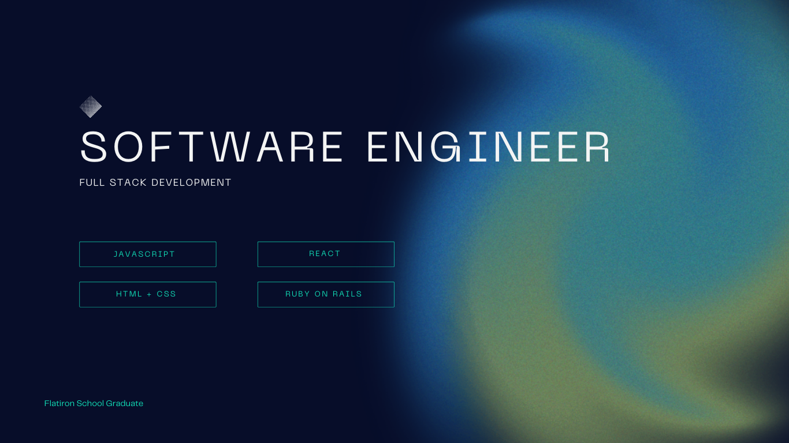

### Hi there 👋

- 🔭 I’m currently working on a new SPA called Nurse&Nappie that tracks and charts the feeding and bathroom behaviors of a newborn baby. 
- 🌱 I’m currently learning to host my SPA's on Heroku, add visual presentation of data with Recharts, and modernize my style with frameworks like FontAwesome, Material UI, and Bootstrap
- 👯 I’m looking to collaborate on both front and backend projects that help solve a need in creative new ways.
- 🤔 I’m looking for help with continuing to grow my development skill sets in a professional environment.
- 💬 Ask me about my experience learning to code and my journey in becoming a Full Stack Software Engineer.
- 📫 How to reach me: Please reach out on LinkedIn - https://www.linkedin.com/in/greg-banks/
- 😄 Pronouns: He/Him
- ⚡ Fun fact: I'm an avid hiker. Living in the NorthEast, I've had the privilege of exploring the Catskills, the Berkshires, and the Adirondacks.

<table>
  <tr>
    <th>JavaScript</th>
    <th>- HTML -</th>
    <th>- CSS -</th>
    <th>- React -</th>
    <th>Ruby On Rails</th>
    <th>Postgresql</th>
    <th>- Heroku -</th>
    <th>- npm -</th>
    <th>WordPress</th>
  </tr>
  <tr>
    <td></td>
    <td></td>
    <td></td>
    <td></td>
    <td></td>
    <td></td>
    <td></td>
    <td></td>
    <td></td>
  </tr>
</table>

